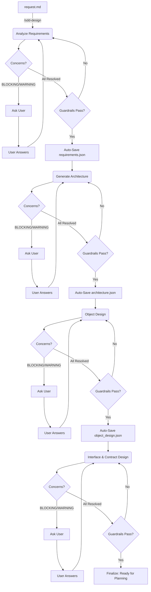

# SDD Design Engine

This skill consolidates the entire design phase into a unified, friction-free flow. It transforms a structured `request.md` (produced by `sdd-request-engine`) into precise technical specifications through an automated pipeline with built-in **Ambiguity Resolution**.

## Core Responsibilities

1.  **Unified Design Flow**: Seamlessly transitions from Requirements Analysis → System Architecture → Object Design → Interface & Contract Design.
2.  **Ambiguity Resolution**: Surface concerns, ask clarifying questions, and converge on precise specs before proceeding.
3.  **Continuous Guardrails**: Automatically invokes `sdd-guardrails` at every sub-stage to ensure consistency.
4.  **Auto-Persistence**: Automatically saves state to `sdd-knowledge-base`—no manual commit steps required.
5.  **Drift Management**: Handles feedback from implementation via `/sdd-spec-update`.

## Commands

-   `/sdd-design`: Main entry point. Intelligently determines the next design step based on `context.json.current_stage`.
    -   *If no active feature*: Suggest running `/sdd-request` first to create a feature and produce `request.md`.
    -   *If stage is `design` and `request.md` exists*: Starts Requirements Analysis.
    -   *If requirements exist*: Proceed to Architecture.
    -   *If architecture exists*: Proceed to Object Design.
    -   *If object design exists*: Proceed to Interface & Contract Design.
-   `/sdd-design-requirements`: Force entry into Requirements Analysis.
-   `/sdd-design-architecture`: Force entry into Architecture Design.
-   `/sdd-design-objects`: Force entry into Object Design.
-   `/sdd-design-interfaces`: Force entry into Interface & Contract Design.
-   `/sdd-spec-update`: Adjust spec based on "drift" detected during implementation.

## JSON Writing Rule

When generating any JSON artifact (`requirements.json`, `architecture.json`, `data_api.json`, `concerns.json`), all string values MUST have special characters properly escaped (`\"`, `\\`, `\n`, `\t`, control chars). Validate JSON is well-formed before writing to disk. If validation fails, fix escaping issues before saving.

## Feature-Scoped Output

All spec artifacts are written to `.sdd/spec/<feature-id>/`:
- `requirements.json`
- `architecture.json`
- `object_design.json`
- `openapi.yaml` — *if feature involves HTTP APIs*
- `data_api.json` — *if feature involves persistent data*
- `interface_contract.json` — *if feature has other interface boundaries (CLI, SDK, events, IPC, etc.)*
- `diagrams/*.mmd` (component, sequence, class diagrams)
- `concerns.json` (clarification history)

The `<feature-id>` is read from `context.json.current_feature`. If null, prompt the user for a feature name before proceeding.

## Ambiguity Resolution Protocol

**Between every sub-stage**, the agent runs a clarification loop before writing final output:

### Step 1: Analyze and Score
After analyzing user intent or input artifacts, the agent assigns a **confidence assessment** to each generated item and produces a `concerns.json`:

```json
{
    "feature": "user-auth",
    "stage": "requirements",
    "concerns": [
        {
            "id": "C-001",
            "category": "BLOCKING",
            "question": "Authentication via JWT or Session-based?",
            "context": "Both are viable but affect architecture significantly.",
            "answer": null,
            "resolved": false
        },
        {
            "id": "C-002",
            "category": "WARNING",
            "question": "Assuming minimum password length is 8 characters. OK?",
            "context": "No explicit requirement stated.",
            "answer": null,
            "resolved": false
        },
        {
            "id": "C-003",
            "category": "INFO",
            "question": "Per project_rules.md, using Clean Architecture.",
            "context": "Matches architecture_style in context.json.",
            "answer": null,
            "resolved": false
        }
    ]
}
```

### Step 2: Categorize Concerns

| Category | Meaning | Behavior |
|----------|---------|----------|
| **BLOCKING** | Must clarify before proceeding | Agent stops and asks the user |
| **WARNING** | Can assume but needs user confirmation | Agent states assumption and asks for confirmation |
| **INFO** | Informational, no action needed | Agent informs and proceeds |

### Step 3: Resolve and Iterate
1.  **STOP and Ask User**: If ANY **BLOCKING** concerns exist, you **MUST** present them to the user and **WAIT** for their response. **DO NOT** proceed. **DO NOT** makeup answers.
2.  **Collect Answers**: Record user answers in `concerns.json`.
3.  **Re-incorporate**: Re-incorporate answers into the spec.
4.  **Re-run Analysis**: If new concerns arise, repeat.
5.  **Proceed**: Only proceed to the next sub-stage when **ALL** BLOCKING items are resolved.

### Post-step: Feedback Capture (MANDATORY)
After presenting any design artifact to the user, if the user requests changes or corrections:
1.  Apply the requested changes to the design artifact.
2.  **Immediately** write a lesson to `.sdd/knowledge/lessons/` capturing:
    -   What was originally generated vs what the user corrected.
    -   Why the correction was needed (infer from context or ask the user).
    -   Tags for future retrieval (feature name, design stage, domain keywords).
3.  If the correction reveals a reusable pattern (e.g., a preferred architectural style, a standard API convention), also save to `.sdd/knowledge/patterns/`.

This is NOT optional. Every user correction during design is a gap between expectation and reality — it MUST be recorded as a lesson.

## Design Pipeline

### Pre-step: Knowledge Lookup (MANDATORY — Index-Based)
Before generating **any** design artifact (requirements, architecture, or API), the engine MUST:
1.  Read `.sdd/knowledge/index.json` (the lightweight index).
2.  Filter `patterns` entries whose `tags` overlap with the current feature's domain keywords.
3.  Filter `lessons` entries whose `tags` overlap OR whose `trigger` matches `"designing-*"`.
4.  Load ONLY the matched files (via the `file` path in each index entry). Do NOT scan the full `patterns/` or `lessons/` directories.
5.  Summarize relevant findings and incorporate them into the design output.
6.  If no matches found in the index, proceed normally without loading any knowledge files.
7.  **Output the knowledge match results** before proceeding to the design pipeline:

```
📚 **Knowledge Loaded** (stage: design)

| Type | ID | Matched Tags | Summary |
|------|----|-------------|---------|
| <type> | <id> | `<tag1>`, `<tag2>` | <summary> |

> No knowledge matched. (if empty)
```

### 1. Requirements (formerly `sdd-requirements-engine`)
-   **Input**: `.sdd/spec/<feature-id>/request.md` (produced by `sdd-request-engine`).
-   **Action**: Transform structured user stories and acceptance criteria into technical requirements. Assign `confidence_score` to each requirement.
-   **Clarify**: Run Ambiguity Resolution Protocol. Resolve all BLOCKING concerns.
-   **Output**: `.sdd/spec/<feature-id>/requirements.json`.
-   **Guardrail**: Check for ambiguity and potential conflicts with `project_rules.md`.

### 2. Architecture (formerly `sdd-architecture-system`)
-   **Input**: `requirements.json`.
-   **Action**: Generate Mermaid diagrams (Component, Sequence) and architectural decisions.
-   **Clarify**: Run Ambiguity Resolution Protocol (e.g., "Should User and Session be separate bounded contexts?").
-   **Output**: `.sdd/spec/<feature-id>/architecture.json` + `.sdd/spec/<feature-id>/diagrams/*.mmd`.
-   **Guardrail**: Ensure all user stories are covered by components. Validate architecture style compliance (see `sdd-guardrails`).

### 3. Object Design
-   **Input**: `architecture.json`.
-   **Action**:
    -   Define core **design units** appropriate to the project — classes/interfaces (OOP), modules/functions (FP), components/hooks (UI), commands/handlers (CLI), resources/modules (IaC), etc.
    -   Define **abstractions** — dependency inversion boundaries between layers.
    -   Define **relationships** — inheritance, composition, dependency, association.
    -   Generate **Class / Module Diagram** (Mermaid).
-   **Clarify**: Run Ambiguity Resolution Protocol on structural decisions.
-   **Output**: `.sdd/spec/<feature-id>/object_design.json` (see `templates/object_design.json`) + `.sdd/spec/<feature-id>/diagrams/class.mmd`.
-   **Guardrail**: Validate layer boundaries per `project_rules.md`. Ensure all components from `architecture.json` have corresponding design units.

### 4. Interface & Contract Design
-   **Input**: `object_design.json` + `architecture.json`.
-   **Action**: Define the external-facing contracts and data schemas appropriate to the feature. Produce **only the artifacts relevant to the feature's interface boundaries**:

    | Artifact | When to produce |
    |----------|----------------|
    | `openapi.yaml` | Feature exposes or consumes HTTP/REST APIs |
    | `data_api.json` | Feature involves persistent data (DB entities, schemas) |
    | `interface_contract.json` | Feature has non-HTTP interfaces (CLI args, SDK public API, event schemas, IPC, etc.) |

    If the feature has **no external interface boundaries** (e.g., a pure refactoring or internal library), this stage may be skipped entirely.
-   **Clarify**: Run Ambiguity Resolution Protocol on interface decisions.
-   **Output**: Whichever artifacts from the table above are relevant, written to `.sdd/spec/<feature-id>/`.
-   **Guardrail**: Validate consistency between produced interface specs and `object_design.json`; check for breaking changes.

## Compounding Features

-   **Pattern Recognition**: When generating architecture/interfaces, the engine queries `sdd-knowledge-base` for similar past patterns by **tags** to suggest proven designs.
-   **Lessons Learned**: Checks `sdd-knowledge-base` for "avoid" lists before making decisions.

## Stage Transitions

After completing each sub-stage successfully:
1.  Auto-save artifacts to feature directory.
2.  Update `context.json.current_stage` appropriately.
3.  After all design sub-stages complete, set `current_stage` to `"design-complete"`.



## Example Usage

```
User: /sdd-design
Agent: Active feature: "001-user-auth". Found request.md.

       [Requirements] Analyzing request.md...
       > Generated 5 Technical Requirements from User Stories.
       > Confidence: REQ-001 (1.0), REQ-002 (0.8), REQ-003 (0.5)

       ⚠️ BLOCKING Concerns:
       - C-001: JWT or session-based tokens for social auth?

       ℹ️ INFO:
       - C-002: Per project_rules, using Clean Architecture.

User: JWT with refresh tokens.

Agent: > Resolved. Updating requirements...
       > All concerns resolved. Guardrails passed. Auto-saving...

       [Architecture] Generating...
       ...

       [Object Design] Analyzing architecture components...
       > Defined 4 Domain Classes: User, UserProfile, AuthToken, UserRepository.
       > Generated class diagram with relationships.

       ⚠️ BLOCKING Concerns:
       - C-004: Should UserService implement IAuthService or be a separate class?

User: Separate class. UserService handles profile, AuthService handles auth.

Agent: > Resolved. Auto-saving object_design.json + class.mmd...

       [Interface & Contract Design] Analyzing interface boundaries...
       ...
```
