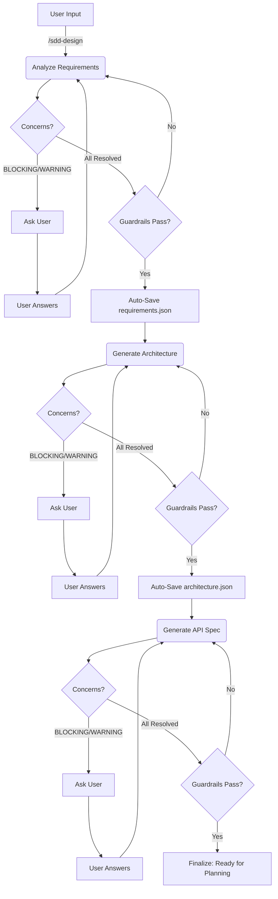

# SDD Design Engine

This skill consolidates the entire design phase into a unified, friction-free flow. It transforms vague user intent into precise technical specifications through an automated pipeline with built-in **Ambiguity Resolution**.

## Core Responsibilities

1.  **Unified Design Flow**: Seamlessly transitions from Requirements Analysis → System Architecture → Data/API Design.
2.  **Ambiguity Resolution**: Surface concerns, ask clarifying questions, and converge on precise specs before proceeding.
3.  **Continuous Guardrails**: Automatically invokes `sdd-guardrails` at every sub-stage to ensure consistency.
4.  **Auto-Persistence**: Automatically saves state to `sdd-knowledge-base`—no manual commit steps required.
5.  **Drift Management**: Handles feedback from implementation via `/sdd-spec-update`.

## Commands

-   `/sdd-design`: Main entry point. Intelligently determines the next design step based on `context.json.current_stage`.
    -   *If no active feature*: Prompt user for feature name, create feature directory, set `current_feature`.
    -   *If stage is `design`*: Starts Requirements Analysis.
    -   *If requirements exist*: Proceed to Architecture.
    -   *If architecture exists*: Proceed to Data/API.
-   `/sdd-design-requirements`: Force entry into Requirements Analysis.
-   `/sdd-design-architecture`: Force entry into Architecture Design.
-   `/sdd-design-api`: Force entry into Data/API Design.
-   `/sdd-spec-update`: Adjust spec based on "drift" detected during implementation.

## Feature-Scoped Output

All spec artifacts are written to `.sdd/spec/<feature-id>/`:
- `requirements.json`
- `architecture.json`
- `openapi.yaml`
- `data_api.json`
- `diagrams/*.mmd`
- `concerns.json` (clarification history)

The `<feature-id>` is read from `context.json.current_feature`. If null, prompt the user for a feature name before proceeding.

## Ambiguity Resolution Protocol

**Between every sub-stage**, the agent runs a clarification loop before writing final output:

### Step 1: Analyze and Score
After analyzing user intent or input artifacts, the agent assigns a **confidence assessment** to each generated item and produces a `concerns.json`:

```json
{
    "feature": "user-auth",
    "stage": "requirements",
    "concerns": [
        {
            "id": "C-001",
            "category": "BLOCKING",
            "question": "Authentication via JWT or Session-based?",
            "context": "Both are viable but affect architecture significantly.",
            "answer": null,
            "resolved": false
        },
        {
            "id": "C-002",
            "category": "WARNING",
            "question": "Assuming minimum password length is 8 characters. OK?",
            "context": "No explicit requirement stated.",
            "answer": null,
            "resolved": false
        },
        {
            "id": "C-003",
            "category": "INFO",
            "question": "Per project_rules.md, using Clean Architecture.",
            "context": "Matches architecture_style in context.json.",
            "answer": null,
            "resolved": false
        }
    ]
}
```

### Step 2: Categorize Concerns

| Category | Meaning | Behavior |
|----------|---------|----------|
| **BLOCKING** | Must clarify before proceeding | Agent stops and asks the user |
| **WARNING** | Can assume but needs user confirmation | Agent states assumption and asks for confirmation |
| **INFO** | Informational, no action needed | Agent informs and proceeds |

### Step 3: Resolve and Iterate
1.  Present all BLOCKING and WARNING concerns to the user.
2.  Collect answers and record them in `concerns.json`.
3.  Re-incorporate answers into the spec.
4.  Re-run analysis. If new concerns arise, repeat.
5.  Proceed to the next sub-stage only when all BLOCKING items are resolved.

### When to Record a Lesson
If the user **corrects** the agent's output during clarification (e.g., rejects a requirement, changes an assumption), this is a gap between expectation and reality. The agent should trigger `/sdd-learn` to record the correction as a lesson.

## Design Pipeline

### 1. Requirements (formerly `sdd-requirements-engine`)
-   **Input**: User conversation / Intent.
-   **Action**: Extract structured constraints and user stories. Assign `confidence_score` to each requirement.
-   **Clarify**: Run Ambiguity Resolution Protocol. Resolve all BLOCKING concerns.
-   **Output**: `.sdd/spec/<feature-id>/requirements.json`.
-   **Guardrail**: Check for ambiguity and potential conflicts with `project_rules.md`.

### 2. Architecture (formerly `sdd-architecture-system`)
-   **Input**: `requirements.json`.
-   **Action**: Generate Mermaid diagrams (Component, Sequence) and architectural decisions.
-   **Clarify**: Run Ambiguity Resolution Protocol (e.g., "Should User and Session be separate bounded contexts?").
-   **Output**: `.sdd/spec/<feature-id>/architecture.json` + `.sdd/spec/<feature-id>/diagrams/*.mmd`.
-   **Guardrail**: Ensure all user stories are covered by components. Validate architecture style compliance (see `sdd-guardrails`).

### 3. Data & API (formerly `sdd-data-api-engine`)
-   **Input**: `architecture.json`.
-   **Action**: Define Schema (ERD) and API Spec (OpenAPI).
-   **Clarify**: Run Ambiguity Resolution Protocol (e.g., "Pagination cursor-based or offset? Need streaming endpoint?").
-   **Output**: `.sdd/spec/<feature-id>/openapi.yaml` + `.sdd/spec/<feature-id>/data_api.json`.
-   **Guardrail**: Validate Schema vs. API mismatch; check for breaking changes.

## Compounding Features

-   **Pattern Recognition**: When generating architecture/API, the engine queries `sdd-knowledge-base` for similar past patterns by **tags** (e.g., `crud`, `auth`) to suggest proven designs.
-   **Lessons Learned**: Checks `sdd-knowledge-base` for "avoid" lists before making decisions.

## Stage Transitions

After completing each sub-stage successfully:
1.  Auto-save artifacts to feature directory.
2.  Update `context.json.current_stage` appropriately.
3.  After all design sub-stages complete, set `current_stage` to `"design-complete"`.



## Example Usage

```
User: /sdd-design
Agent: No active feature. What feature are you building?
User: User authentication with social login
Agent: Setting feature ID: "user-auth". Creating .sdd/spec/user-auth/...

       [Requirements] Analyzing intent...
       > Generated 5 User Stories.
       > Confidence: REQ-001 (1.0), REQ-002 (0.8), REQ-003 (0.5)

       ⚠️ BLOCKING Concerns:
       - C-001: Which social providers? (Google, GitHub, Apple?)
       - C-002: Do social-login users also need password-based login?

       ℹ️ INFO:
       - C-003: Per project_rules, using Clean Architecture.

User: Google and GitHub only. No password fallback for social users.

Agent: > Resolved. Updating requirements...
       > All concerns resolved. Guardrails passed. Auto-saving...

       [Architecture] Generating...
       ...
```
