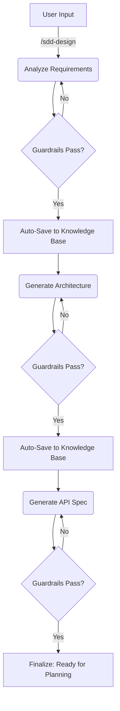

# SDD Design Engine

This skill consolidates the entire design phase into a unified, friction-free flow. It transforms vague user intent into precise technical specifications through an automated pipeline.

## Core Responsibilities

1.  **Unified Design Flow**: Seamlessly transitions from Requirements Analysis → System Architecture → Data/API Design.
2.  **Continuous Guardrails**: Automatically invokes `sdd-guardrails` at every sub-stage to ensure consistency.
3.  **Auto-Persistence**: Automatically saves state to `sdd-knowledge-base`—no manual commit steps required.
4.  **Drift Management**: Handles feedback from implementation via `/sdd-spec-update`.

## Commands

-   `/sdd-design`: Main entry point. Intelligently determines the next design step based on current state.
    -   *If empty*: Starts Requirements Analysis.
    -   *If requirements exist*: Proceed to Architecture.
    -   *If architecture exists*: Proceed to Data/API.
-   `/sdd-design-requirements`: Force entry into Requirements Analysis.
-   `/sdd-design-architecture`: Force entry into Architecture Design.
-   `/sdd-design-api`: Force entry into Data/API Design.
-   `/sdd-spec-update`: Adjust spec based on "drift" detected during implementation.

## Design Pipeline

### 1. Requirements (formerly `sdd-requirements-engine`)
-   **Input**: User conversation / Intent.
-   **Action**: Extract structured constraints and user stories.
-   **Output**: `.sdd/spec/requirements.json`.
-   **Guardrail**: Check for ambiguity and potential conflicts with `project_rules.md`.

### 2. Architecture (formerly `sdd-architecture-system`)
-   **Input**: `requirements.json`.
-   **Action**: Generate Mermaid diagrams (Component, Sequence) and architectural decisions.
-   **Output**: `.sdd/spec/architecture.json` + `.sdd/spec/diagrams/*.mmd`.
-   **Guardrail**: Ensure all user stories are covered by components.

### 3. Data & API (formerly `sdd-data-api-engine`)
-   **Input**: `architecture.json`.
-   **Action**: Define Schema (ERD) and API Spec (OpenAPI).
-   **Output**: `.sdd/spec/openapi.yaml` + `.sdd/spec/data_api.json`.
-   **Guardrail**: Validate Schema vs. API mismatch; check for breaking changes.

## Compounding Features

-   **Pattern Recognition**: When generating architecture/API, the engine queries `sdd-knowledge-base` for similar past patterns (e.g., "Standard Auth Flow") to suggest proven designs.
-   **Lessons Learned**: Checks `sdd-knowledge-base` for "avoid" lists before making decisions.

## Auto-Save & Transition Logic

Unlike previous versions, this skill **automatically advances** and **automatically saves**.



## Example Usage

```
User: /sdd-design
Agent: [Requirements] logic...
       > Generated 3 User Stories.
       > Guardrails passed. Auto-saving...
       
       [Architecture] logic...
       > Generated Component Diagram.
       > Guardrails passed. Auto-saving...
       
       [API] logic...
       > Generated openapi.yaml.
       > Guardrails passed. Auto-saving...
       
       Design phase complete. Ready for implementation planning.
```
